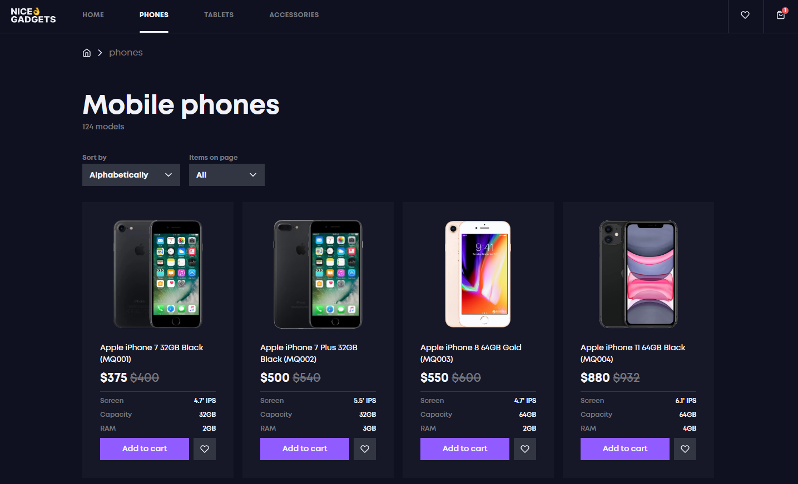
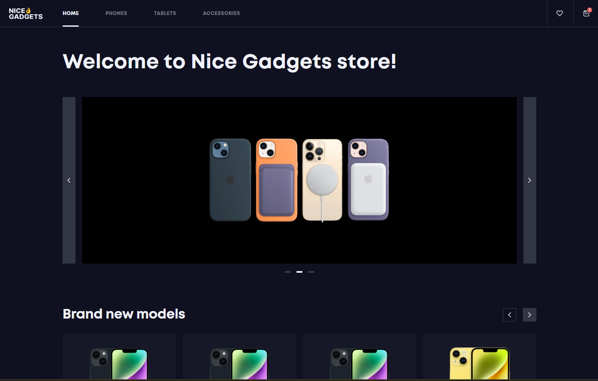

# 🛍️ React Product Catalog

A fully functional and stylish product catalog built with **React** and **Redux**, featuring a **dark theme**, shopping cart, favorites, filtering, sorting, pagination, skeletons for loading, and detailed product pages.

## 🌐 Live Demo

- 🔗 [Live Demo](https://dvdmsk.github.io/Phone-catalog/)
- 📁 [GitHub Repo](https://github.com/dvdmsk/Phone-catalog.git)

## 🛠️ Technologies Used

- **React** — for building UI components
- **Redux Toolkit** — global state management
- **TypeScript** — static typing
- **SCSS (Modules)** — scoped styles per component
- **React Router** — routing and navigation
- **Prettier & ESLint** — consistent code formatting
- **Husky** — pre-commit checks
- **localStorage** — persistent cart and favorites
- **Skeletons** — smooth UI while loading
- **Dark Theme** — clean and modern design

## ✨ Features

- 🧭 **Routing** — Home, Product Pages, Cart, Favorites, Not Found
- 🖼️ **Dynamic Image Slider** on homepage with auto and manual navigation
- 🛒 **Shopping Cart** — add/remove/change quantity, total count, stored in localStorage
- ❤️ **Favorites** — add/remove from favorites, stored in localStorage
- 📱 **Category Pages** — Phones, Tablets, Accessories
- 🔍 **Sorting & Pagination** — sort by price, age, and title; pagination with URL params
- 📄 **Product Details Page** — breadcrumbs, product variations, "You may also like" block
- 📦 **Product Sliders** — hot deals & brand new items
- 🧩 **Loader & Error States** — graceful handling of API loading and errors
- 📉 **Empty States** — friendly messages for empty carts or no results
- 🌘 **Dark Theme** — consistent styling across the app
- 📑 **NotFoundPage** — with "Page not found" and redirect link


## 🚀 Getting Started

To run the project locally:

1. **Clone the repository**
   ```bash
   git clone https://github.com/dvdmsk/Phone-catalog.git
   cd Phone-catalog
   ```

2. **Install dependencies**
   ```bash
   npm install
   ```

3. **Start the development server**
   ```bash
   npm start
   ```

## 🧠 UX & Logic Highlights

- Sticky header with cart & favorites icons (quantity displayed)
- Smooth animations on hover
- Image zoom on hover in product lists
- Skeleton placeholders for seamless content loading
- Formatted breadcrumbs on product details
- "Back to Top" button and scroll to top on navigation
- Friendly error handling and fallback states

## ✅ Page Functionality Overview

### 🏠 Home Page

- Image slider (autoplay every 5s, manual arrows, and dot navigation)
- Product sliders for Hot Deals and Brand New
- Shop by Category links

### 📱 Category Pages (/phones, /tablets, /accessories)

- Filters: Sort by Newest, Alphabetically, Cheapest
- Pagination and items per page
- Product skeletons while loading
- Loader and fallback messages

### 📄 Product Details Page

- Product info: images, specs, capacities, colors
- About and Tech Specs sections
- Suggestion block with related products
- Back button and breadcrumb navigation
- Product not found fallback

### 🛒 Cart Page

- Add/remove items
- Change quantity
- Total count and price
- Checkout confirmation modal
- Saved to localStorage

### ❤️ Favorites Page

- List of favorite products
- Add/remove favorites via heart icon
- Saved to localStorage

### ❌ Not Found Page

- For all unmatched routes or missing product IDs

## 📸 Screenshot







## 🤝 Contributing

Contributions are welcome! Please fork the repository and open a PR with your changes.

## 📬 Contact Me

- 💬 Telegram: [@dvd5678](https://t.me/dvd5678)
- 📧 Email: [dvdmsk21@gmail.com](mailto:dvdmsk21@gmail.com)
- 💼 LinkedIn: [David Moskalenko](https://www.linkedin.com/in/david-moskalenko-0a68051b8)
